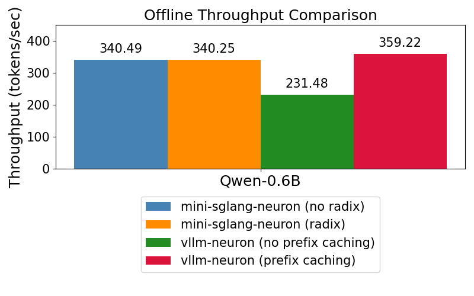
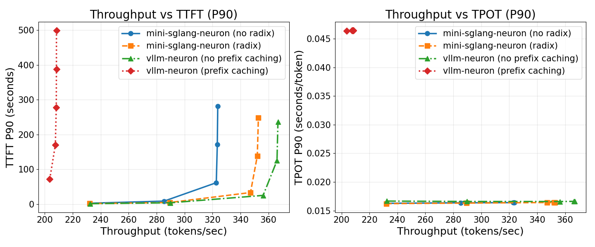

# Mini-SGLang-Neuron

A **lightweight inference framework** for Large Language Models.

---

Mini-SGLang-Neuron is a compact implementation of [SGLang](https://github.com/sgl-project/sglang), designed to demystify modern LLM serving systems. This repository currently focuses on a Neuron/XLA-oriented runtime while keeping the codebase readable and modular.

## ✨ Key Features

- **High Performance**: Uses practical serving optimizations for strong throughput and latency.
- **Lightweight & Readable**: A clean, modular, and fully type-annotated codebase that is easy to understand and modify.
- **Advanced Optimizations**:
  - **Radix Cache**: Reuses KV cache for shared prefixes across requests.
  - **Chunked Prefill**: Reduces peak memory usage for long-context serving.
  - **Tensor Parallelism**: Scales inference across TP ranks.
  - **Kernel Acceleration**: Uses low-level kernels where needed (e.g., radix cache key comparison).
  - ...

## 🚀 Quick Start

> **⚠️ Platform Support**: Mini-SGLang-Neuron currently supports **AWS Trainium (Trn) and Inferentia (Inf) only**.

### 0. Setup AWS Trn/Inf Instance

User can choose any cloud service that vends AWS Trn/Inf. We take Yotta Labs as an example for Trn1 instance setup.

1. Go to https://www.yottalabs.ai/. 
2. Click `LAUNCH CONSOLE` on the top right and login.
3. On the left side bar, click `Compute -> Virtual Machines`. 
4. Select Region `us-west-2`, and select the provider `AWS`. 
5. Choose `Trainium1` and other desired configuration. Click `Launch` to start the virtual machine.

### 1. Environment Setup

We recommend using Docker to spin up container with official [pytorch-inference-neuronx](https://github.com/aws-neuron/deep-learning-containers) image for fast setup. Below is an example to spin up the container:

```
docker run --pull=missing -it --rm \
  --privileged \
  --network host \
  --shm-size=32g \
  --ulimit memlock=-1 \
  --ulimit stack=67108864 \
  public.ecr.aws/neuron/pytorch-inference-neuronx:2.9.0-neuronx-py312-sdk2.27.1-ubuntu24.04 \
  bash
```

### 2. Installation

Install Mini-SGLang directly from the source:

```bash
git clone https://github.com/yottalabsai/mini-sglang-neuron.git
cd mini-sglang-neuron && bash init_setup.sh
```

### 3. Interactive Shell

Chat with your model directly in the terminal by adding the `--shell-mode` flag.

```bash
export TP_SIZE=2
export NEURON_RT_NUM_CORES="${TP_SIZE}"
python -m minisgl \
  --model-path "Qwen/Qwen3-0.6B" \
  --dtype bfloat16 \
  --tp-size "$TP_SIZE" \
  --max-running-requests 6 \
  --max-seq-len-override 4096 \
  --num-pages 10192 \
  --port 1919 \
  --shell-mode
``` 

You can also use `/reset` to clear the chat history.

### 4. Online Serving

Launch an OpenAI-compatible API server with a single command.

```bash
# Deploy Qwen/Qwen3-0.6B 
export TP_SIZE=2
export NEURON_RT_NUM_CORES="${TP_SIZE}"
python -m minisgl \
  --model-path "Qwen/Qwen3-0.6B" \
  --dtype bfloat16 \
  --tp-size "$TP_SIZE" \
  --max-running-requests 6 \
  --max-prefill-length 8192 \
  --max-seq-len-override 2048 \
  --num-pages 16384 \
  --port 1919
```

Once the server is running, you can send requests using standard tools like `curl` or any OpenAI-compatible client.

```bash
python3 benchmark/online/simple_call.py --prompt "hello"
```


## Profiling

We use `vllm-neuron` as the comparison baseline for the profiling tests below.

Comparison installation command for `vllm-neuron`.

```bash
git clone https://github.com/vllm-project/vllm-neuron.git
cd vllm-neuron

pip install --extra-index-url=https://pip.repos.neuron.amazonaws.com -e .
```

### Offline inference

See [bench.py](./benchmark/offline/bench.py) for more details on `mini-sglang-neuron` profiling. See [bench_vllm_neuron.py](./benchmark/offline/bench_vllm_neuron.py) on `vllm-neuron` profiling.

Test Configuration:

- Hardware: trn1.xlarge, two Neuron Cores.
- Model: Qwen3-0.6B
- Total Requests: 256 sequences
- Input Length: Randomly sampled between 100-1024 tokens
- Output Length: Randomly sampled between 100-1024 tokens



### Online inference

See [bench_qwen.py](./benchmark/online/bench_qwen.py) for more details.

Test Configuration:

- Hardware: trn1.xlarge, two Neuron Cores.
- Model: Qwen3-0.6B
- Dataset: [Qwen trace](https://media.githubusercontent.com/media/alibaba-edu/qwen-bailian-usagetraces-anon/refs/heads/main/qwen_traceA_blksz_16.jsonl"), replaying first 500 requests with no more than 1024 input token length.

Server startup command for `mini-sglang-neuron`: see [server.sh](./server.sh).

```bash
# mini-sglang-neuron (no radix)
export TP_SIZE=2
export NEURON_RT_NUM_CORES="${TP_SIZE}"
python -m minisgl \
  --model-path Qwen/Qwen3-0.6B \
  --dtype bfloat16 \
  --tp-size "$TP_SIZE" \
  --max-running-requests 6 \
  --max-prefill-length 256 \
  --max-seq-len-override 2048 \
  --num-pages 16384 \
  --port 1919 \
  --cache-type naive # Change to "radix"  

# mini-sglang-neuron (radix)
export TP_SIZE=2
export NEURON_RT_NUM_CORES="${TP_SIZE}"
python -m minisgl \
  --model-path Qwen/Qwen3-0.6B \
  --dtype bfloat16 \
  --tp-size "$TP_SIZE" \
  --max-running-requests 6 \
  --max-prefill-length 256 \
  --max-seq-len-override 2048 \
  --num-pages 16384 \
  --port 1919 \
  --cache-type radix
```

Server startup command for `vllm-neuron`.

```bash
# vllm-neuron (no prefix caching)
export TP_SIZE=2
export NEURON_RT_NUM_CORES="${TP_SIZE}"

vllm serve Qwen/Qwen3-0.6B \
  --dtype bfloat16 \
  --tensor-parallel-size "${TP_SIZE}" \
  --max-num-seqs 6 \
  --max-model-len 2048 \
  --port 1919 \
  --max-num-batched-tokens 256 \
  --block-size 128 \
  --num-gpu-blocks-override 6 \
  --no-enable-prefix-caching 

# vllm-neuron (prefix caching)
export TP_SIZE=2
export NEURON_RT_NUM_CORES="${TP_SIZE}"
vllm serve Qwen/Qwen3-0.6B \
  --dtype bfloat16 \
  --tensor-parallel-size "${TP_SIZE}" \
  --max-num-seqs 6 \
  --max-model-len 2048 \
  --port 1919 \
  --max-num-batched-tokens 256 \
  --block-size 128 \
  --num-gpu-blocks-override 128
```

Client command:

```bash
python benchmark/online/bench_qwen.py
```




## 📚 Learn More

- **[Detailed Features](./docs/features.md)**: Explore all available features and command-line arguments.
- **[System Architecture](./docs/structures.md)**: Dive deep into the design and data flow of Mini-SGLang.
